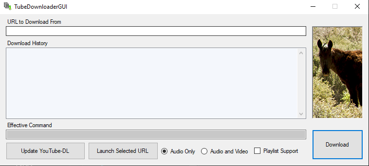

# TubeDownloaderGUI
## Info:

This is a basic front-end for youtube-dl. It allows for my basic needs with a copy/paste workflow familiar to Windows users. 

## Requirements:

Place ffmpeg files and youtube-dl executables in \Bin. This program will reference those files, however they are not included here.

The \Log folder contains pre-requisite check data as well as a log of URLs pasted.

